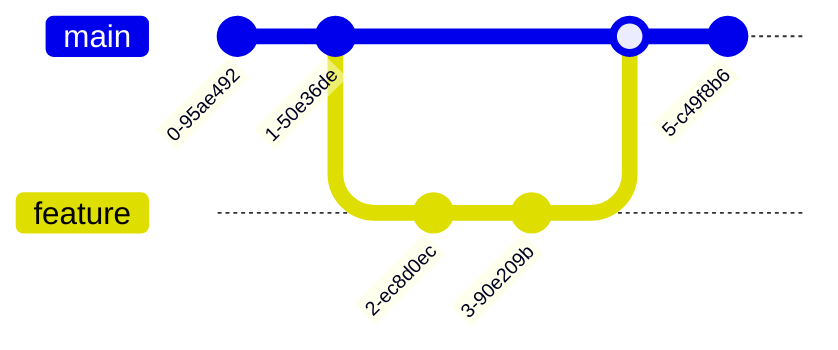

# Exemple Git Diagram

Ce dépôt montre comment utiliser [git-diagram](https://github.com/git-diagram/git-diagram).

## Diagramme Git

Voici un diagramme généré par git-diagram :



## Importer votre dépôt GitHub en local

1. Ouvrez votre terminal ou invite de commandes.
2. Rendez-vous dans le dossier où vous souhaitez cloner le dépôt.
3. Exécutez la commande suivante en remplaçant `<URL_DU_DEPOT>` par l’URL de votre dépôt GitHub :

   ```bash
   git clone <URL_DU_DEPOT>
   ```

4. Accédez au dossier du projet cloné :

   ```bash
   cd nom-du-dossier
   ```